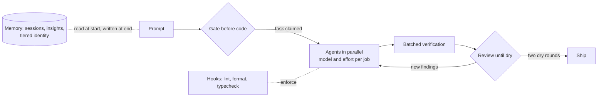

# Amine Karcha

*Software engineer, backend and AI systems. Nantes, remote.*

I build production platforms by day (TypeScript, NestJS, PostgreSQL, Clever Cloud) and agent-driven tooling the rest of the time. Most of what is public here answers one question: how to let coding agents do real work without losing control of what they produce.

## Current work

| Repository | What it is | State |
|---|---|---|
| [jarvis](https://github.com/thelordofpigeons/jarvis) | A personal daemon that reads my repos, task tracker and notes every morning, gates every item through a fail-closed privacy tier before any model sees it, and writes one digest. Hash-chained audit log, budget ledger, kill switch, web hub, local-model adapter. | Running on my machine; local-model tier and work hub are the next phases |
| [claude-harness-kit](https://github.com/thelordofpigeons/claude-harness-kit) | The hooks, multi-agent workflow scripts, agent definitions and memory scaffold I use with Claude Code, sanitized. Gate before code, model routing by job, batched verification, adversarial review loops with a convergence guard. | Edited copies of files in daily use, each labeled |
| [train-speed-profile-surrogate](https://github.com/thelordofpigeons/train-speed-profile-surrogate) | PyTorch surrogate for energy-optimal train speed profiles, built with the LAMIH laboratory (UPHF). Physics-informed losses, hard boundary conditions, millisecond inference. | Code only, dataset under NDA |

## Earlier

| Repository | What it is |
|---|---|
| [LS2N-SUMO-Simulator](https://github.com/thelordofpigeons/LS2N-SUMO-Simulator) | Truck logistics simulation on SUMO with TraCI, mission scripting and a GUI |
| [nantes_traffic_archiver](https://github.com/thelordofpigeons/nantes_traffic_archiver) | Collector for Nantes Metropole real-time traffic data |
| [nantes-traffic-analysis](https://github.com/thelordofpigeons/nantes-traffic-analysis) | Temporal analysis on top of the archived traffic data |

## How I work with agents

Every coding task passes a gate before any edit: classify, announce, track, then build. Agents get a model and an effort level per job, run in parallel under a concurrency cap, and their output goes through batched verification and adversarial review until two rounds find nothing new. Hooks enforce the parts that should not depend on anyone's discipline. A persistent memory carries projects, decisions and preferences across sessions, with a sensitive tier that is never loaded automatically.

Engineering degree, INSA Hauts-de-France, 2025. French, English, Arabic.
